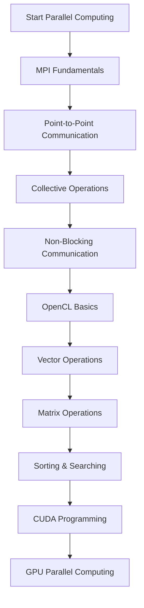

<div align="center">

# ⚡ Learn Parallel & Distributed Computing


A beginner-friendly repository designed to help students **learn Parallel & Distributed Computing through practical MPI, OpenCL, and CUDA lab implementations**.

</div>

---

# 📑 Table of Contents

- Overview
- Project Objective
- Technologies Used
- Programming Languages
- How It Works — Step-by-step
- Learning Workflow
- Labs Included
- Key Concepts
- What I Learned
- Through this project I also gained insight into
- Project Structure
- How to Run the Project
- Future Improvements
- Author
- License

---

# 📘 Overview

Parallel and Distributed Computing is an important field of computer science that focuses on solving computational problems faster by utilizing multiple processors or GPUs simultaneously.

It is widely used in:

- High Performance Computing (HPC)
- Scientific Computing
- Artificial Intelligence
- Machine Learning
- Data Processing
- Image Processing
- Cloud Computing

This repository provides a **structured learning path through hands-on lab exercises** covering CPU-based and GPU-based parallel programming.

Instead of learning only theory, this repository focuses on:

- **Practical implementations**
- **Step-by-step learning**
- **Parallel programming concepts**
- **GPU programming fundamentals**

By following these labs, students can gradually progress from **basic MPI programming to GPU computing using OpenCL and CUDA**.

---

# 🎯 Project Objective

The goals of this repository are:

- Learn the fundamentals of Parallel & Distributed Computing
- Understand process communication using MPI
- Explore GPU programming using OpenCL
- Learn CUDA programming basics
- Build a strong foundation in High Performance Computing (HPC)
- Practice parallel programming through laboratory exercises

---

# 🛠 Technologies Used

The following technologies were used throughout this project.

### MPI (Message Passing Interface)

Used for developing distributed applications using multiple processes and message passing.

### OpenCL

Used for heterogeneous parallel programming across CPUs and GPUs.

### CUDA

Used for GPU programming on NVIDIA graphics cards.

### GCC / NVCC

Used to compile C/C++ and CUDA programs.

### Git & GitHub

Used for version control and project management.

---

# 💻 Programming Languages

The repository primarily uses:

- C
- C++
- CUDA C

---

# ⚙️ How It Works — Step-by-step

The repository follows a progressive learning approach.

1. Learn MPI fundamentals.
2. Understand process communication.
3. Explore collective communication operations.
4. Practice synchronization techniques.
5. Implement non-blocking communication.
6. Learn OpenCL kernel programming.
7. Perform vector and matrix computations on GPUs.
8. Implement searching and sorting algorithms.
9. Learn CUDA programming for parallel array and matrix operations.

Each lab builds upon previous concepts to strengthen understanding of parallel computing.

---

# 🔄 Learning Workflow



This workflow represents the learning roadmap used throughout the repository.

---

# 🧪 Labs Included

## 🔹 MPI — Message Passing Interface (Labs 1–9)

These labs introduce distributed programming concepts using MPI.

Topics include:

- MPI Environment Setup
- Process Management
- Point-to-Point Communication
- Advanced Communication
- Collective Communication
- Synchronization
- Data Movement
- Collective Computation
- Non-Blocking Communication

---

## 🔹 OpenCL — GPU Computing (Labs 10–13)

These labs introduce heterogeneous parallel programming using OpenCL.

Topics include:

- Vector Operations
- String Processing
- Performance Measurement
- Matrix Operations
- Parallel Sorting
- Parallel Searching

---

## 🔹 CUDA — GPU Programming (Lab 14)

The final lab introduces GPU programming using CUDA.

Topics include:

- Array Operations
- Matrix Operations
- Parallel Execution on NVIDIA GPUs

---

# 🧠 Key Concepts

| Concept | Description |
|----------|-------------|
| ⚙️ MPI | Process creation and communication |
| 📨 Message Passing | Sending and receiving data between processes |
| 🔄 Collective Operations | Broadcast, Scatter, Gather, Reduce |
| ⏳ Non-Blocking Communication | Overlap communication with computation |
| 🖥️ OpenCL | Cross-platform GPU programming |
| 🚀 CUDA | NVIDIA GPU parallel programming |
| 📊 Performance | Measuring execution speedup |
| 💻 HPC | High Performance Computing concepts |

---

# 🎓 What I Learned

While building this repository, I gained experience in:

- Writing parallel programs using MPI
- Understanding distributed system communication
- Developing GPU programs with OpenCL
- Learning CUDA programming fundamentals
- Comparing CPU and GPU execution models
- Organizing laboratory implementations for educational purposes
- Using GitHub for technical documentation

---

# 💡 Through this project I also gained insight into

- Parallel programming techniques
- Process synchronization
- Inter-process communication
- GPU architecture basics
- High Performance Computing workflows
- Performance optimization strategies
- Writing clean and well-documented code

---

# 📁 Project Structure

```text
LearnParallel&DistributedComputing
│
├── Lab01_MPI/
├── Lab02_MPI/
├── Lab03_MPI/
├── Lab04_MPI/
├── Lab05_MPI/
├── Lab06_MPI/
├── Lab07_MPI/
├── Lab08_MPI/
├── Lab09_MPI/
│
├── Lab10_OpenCL/
├── Lab11_OpenCL/
├── Lab12_OpenCL/
├── Lab13_OpenCL/
│
├── Lab14_CUDA/
│
└── README.md
```

### Repository Organization

- **Lab01–Lab09** → MPI Programming
- **Lab10–Lab13** → OpenCL Programming
- **Lab14** → CUDA Programming
- **README.md** → Project Documentation

---

# ▶️ How to Run the Project

### Step 1 — Clone the Repository

```bash
git clone https://github.com/yourusername/LearnParallelAndDistributedComputing.git
```

### Step 2 — Navigate to the Repository

```bash
cd LearnParallelAndDistributedComputing
```

### Step 3 — Compile MPI Programs

```bash
mpicc program.c -o program
mpirun -np 4 ./program
```

### Step 4 — Compile OpenCL Programs

```bash
gcc program.c -lOpenCL -o program
./program
```

### Step 5 — Compile CUDA Programs

```bash
nvcc program.cu -o program
./program
```

---

# 🚀 Future Improvements

Planned additions include:

- More CUDA optimization examples
- OpenMP implementations
- Hybrid MPI + OpenMP programs
- Advanced CUDA memory optimization
- Performance benchmarking
- Multi-GPU programming examples
- Mini HPC projects

---

# 👨‍💻 Author


**ft-FiasCode**

GitHub: https://github.com/ft-FiasCode

---

# 📜 License

MIT License: 

This project is open-source and free to use, modify, and distribute.

---

<div align="center">

⭐ If you found this project useful, consider **starring the repository**.

Happy Learning & Happy Parallel Programming! 🚀

</div>
